# Copilot Agentic Demo

This practical training will help you to become familiar with powerfull agentic tools of GitHub such as: Copilot Coding Agent and GitHub Copilot Code Review, also we will be covering custom documentation spaces by using GitHub Copilot Spaces.

To find out more info about these tools you can check the documentation links below.

- [Coding Agent](https://docs.github.com/en/enterprise-cloud@latest/copilot/how-tos/use-copilot-agents/coding-agent)
- [Copilot Spaces](https://docs.github.com/en/copilot/how-tos/provide-context/use-copilot-spaces)
- [Code Review](https://docs.github.com/en/copilot/how-tos/use-copilot-agents/request-a-code-review)


## 🚀 Run the app.

To get this application up and running check the [about](./about.md) page. It contains the steps and requirements needed to run this application locally.

## 📔 Training Excersise

### 🧠 Step 1. Using Copilot Coding Agent (Part 1).

To put some context on the changes we are going to make, the objective here is to change the accent colors of the Todo-List application. Currently the app looks like this:

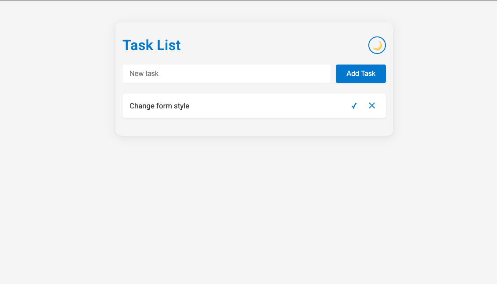

Let's change that blue accent color to a different one using **Copilot Coding Agent**.

To create a new issue, go to the issues tab on this repository.

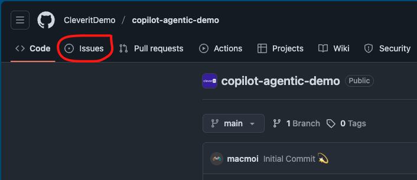

Once in the issues tab, let's create a new issue by clicking the **New Issue** Button.

Once you get there fill the Title and description. For the title, we are going to use this field to indicate precisely the action we want to acomplish with the coding agent, in this case we want to change the accent color of the app.

So for this example use the folowing text as the issue title:

**Issue title**
```
Modify the accent colors on every single component on the application the current color is blue, change it from blue to dark green.
```

And if you want to add more context to the agent, fill the description field to help the AI agent with more info.

**Issue description**
```
Please keep in mind that all changes must be done for both look and feels of the app dark mode and light mode.
```

**Example**


Once you filled both fields, now assign the issue to GitHub Copilot.

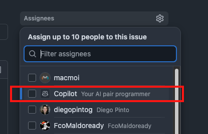

And then save the issue. This will open a new Pull Request in the form of a Draft, copilot will mark this pull request as a Work In Progress (WIP) and start to peform an analysis and strategy to complete the task.

**Issue Asigned to Copilot**

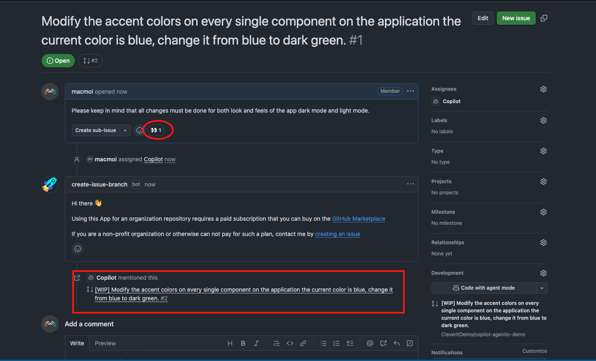

> 💡 **Tip**. 
> Notice the emoji eyes (👀), this means that Copilot is aware of the issue and will start to doing some work.  
> Also, notice how the PR is created as a draft and marked as a Work In Progress (WIP).

This process of copilot doing changes can take long time depending of the requested chages, in the mean time let's explore **GitHub Copilot Spaces**

### 🪐 Step 2. Using GitHub Copiot Spaces.

Copilot spaces is a feature that will provide a "centralized" space where the context can be customized and shared with members within an organization. Is a efficent way to share not only knowledge but also centralize documentation.

In this excercise let's see how we can use GitHub Copilot to generate some documentation about this application an then make it available trough Copilot Spaces.

#### 2.1 Create documentation.

Use GitHub Copilot within your code editor to create documentation files for this project.

First lets create a new branch in the repository called `copilot-spaces-branch`.

```
git checkout -b copilot-spaces-branch
```

Verify that you're in that branch using the follwing command.

```
git branch
```

Now open **VS Code** and open GitHub Copilot Chat in Agent Mode and use the follwing prompt to create the app docs.

**Copilot Prompt**
```
Improve #about.md file to include more advanced documentation of the project. Include sections indicating: Which are the runtimes and frameworks used in this project, explain in a detailed way how to execute the project and how it can be accessed through the browser.

Use a technical language kept in mind a target audience such as Developers, sysadmins, DevOps Engineers and Cloud Engineers.

Include emojis and icons whenever necessary.
```
GitHub Copilot Chat will start making some changes over the [about](about.md). file, you'll see something like this:

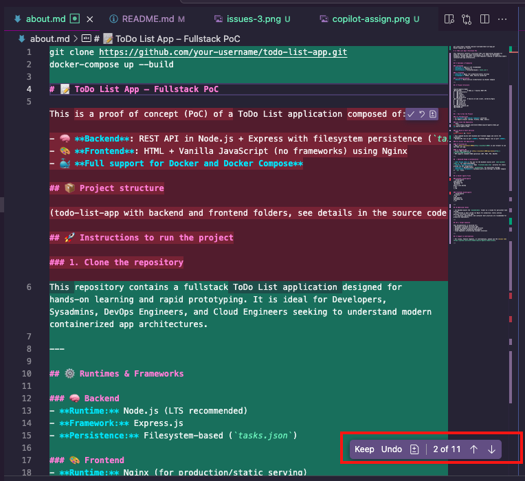

If you're OK with the suggestion just click on "keep" button.

Push the changes into Github by executing the following command.

**Add the files to staging**
```
git add .
```

**Commit the changes**
```
git commit -m "Updated documentation"
```

**Push the changes to Git repository**
```
git push
```

#### 2.2 Creating a Copilot Spaces Environment.

For this part let's go to [GitHub](https://github.com). Here you need to open the sidebar menu and click over the **Copilot** option. See the next image for more details.

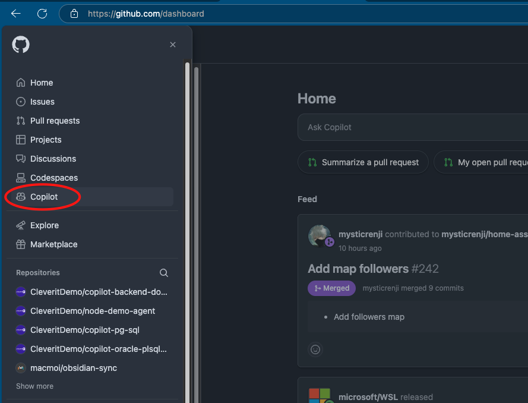

This will open GitHub Copilot web interface, here click the "Spaces" button this will open GitHub Copilot Spaces.

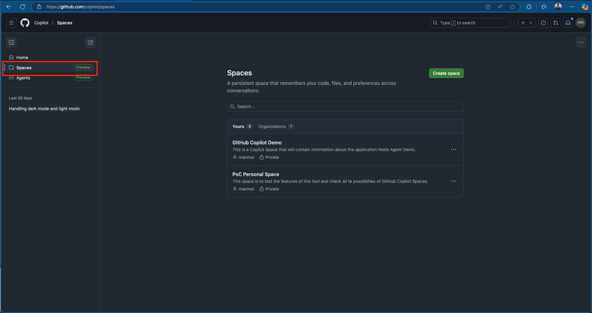

On this view we can create a new space by clicking the button **create space**, you can fill the fields with the following values:

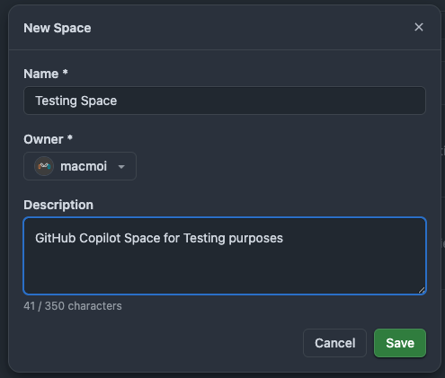

This will create a new Copilot space, now let's begin adding some useful context on this space. Let's add the documentation that we 

Here look for the repository we are working on and add the necessary folders as a source and then click `add`

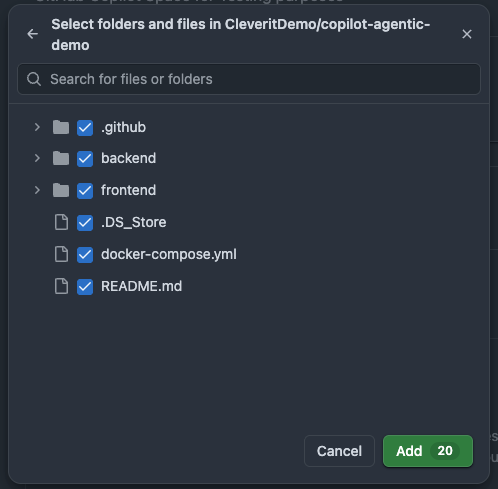

Copilot will start indexing the files and once it's done we can start making some questions about the project. Copilot will response based on the information about the entire project. Including the documentation that we created.

Try it by asiking to GitHub Copilot Spaces te folowing:

```
How can I execute this project and what are the runtimes of copilot-agentic-demo
```

### 🧠 Step 3. Using GitHub Copilot Coding Agent (Part 2.)

While we confgure Copilot Spaces, coding agent was working on background, let's verify the results of the issue we assigned to it. To do that, let's go to the previously created Issue.

- Open the issue.
- Open the Pull Request associated to the Issue and see the results.
- You'll notice GitHub Copilot filled with a lot of details the changes it performed, also added the strategy it used and even some screenshots showing the changes it performed.

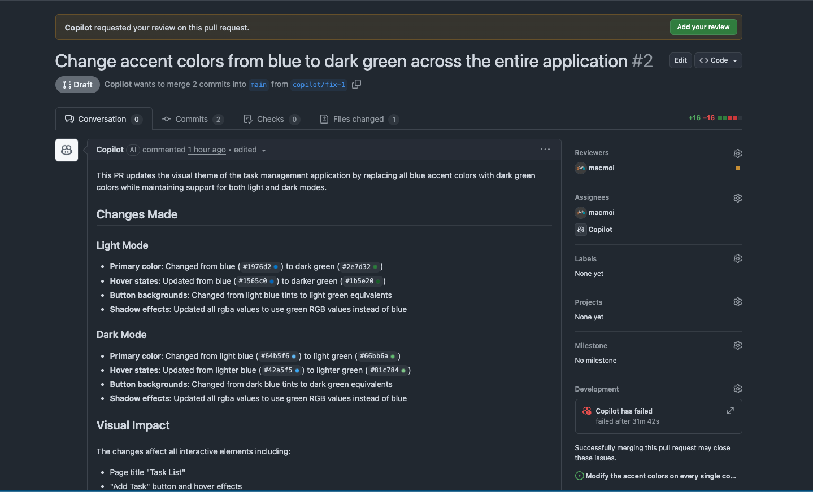.

If we are interested in see how Copilot handled this situation and the strategy and steps it used we can see the activity session by clicking the **view session** button at the bottom part of the pull request, just before the Merge Pull Request button.

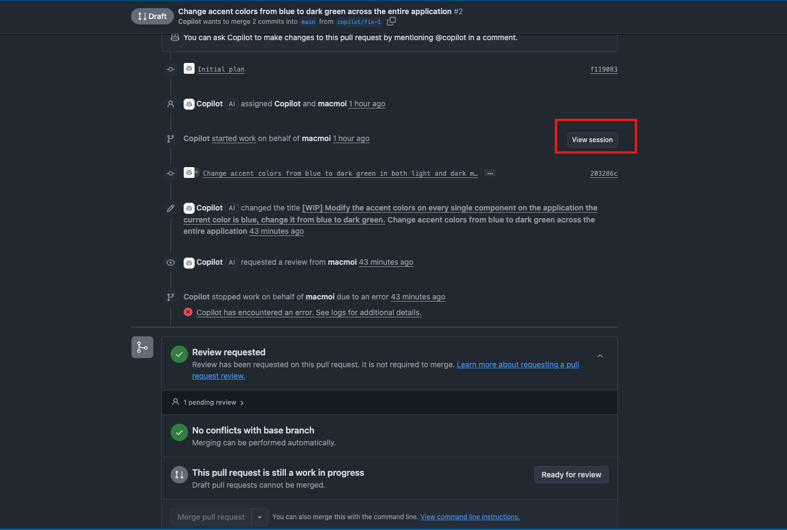

Click there and you'll see a interface very similar to what you found in GitHub Actions, but in this case it will containg all the steps, commands and decisions that Coding Agent took during the execution of the issue. Basically this are the steps it took to complete the task.

If you are OK with this changes we can mark the PR as ready for review and complete the merge request.

This will merge the changes suggested by copilot from the working branch to the target branch (in this case the main branch)

### 👀 Step 4. GitHub Copilot Code Review.

Let's imagine that the suggestions created by coding agent were created by a Teammate or another person, and in the flow of the SDLC a code review is needed. This is something that can be automated with GitHub Copilot.

In order to use agentic Code Review we can just simply go to any opened pull request and assign the revision to GitHub Copilot.

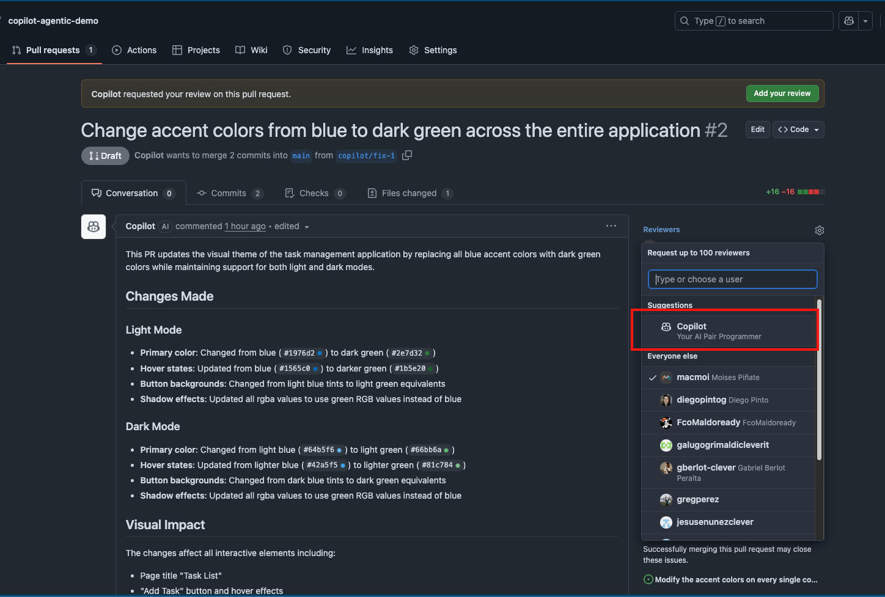

If anything could be improved Copilot wil let automatically comments in the files that can be improved. And also will left an explanaition of the PR and suggestions in the PR itself.

If everything looks good. At this moment you can perform a Merge between the working branch and the main branch.

----

**You have reached the end of the training Congrats.!!💫**

At the end if you pull the changes sugested by copilot and build the app in your local environment, you should see this result:

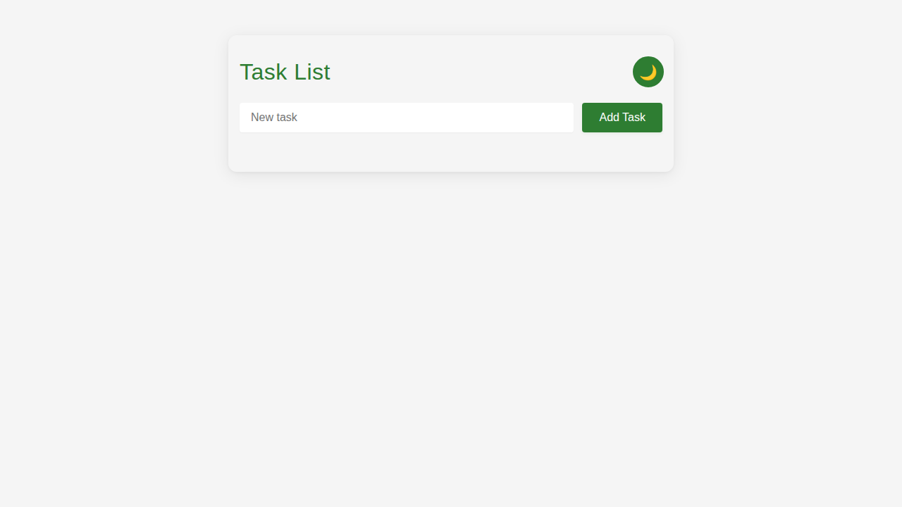
