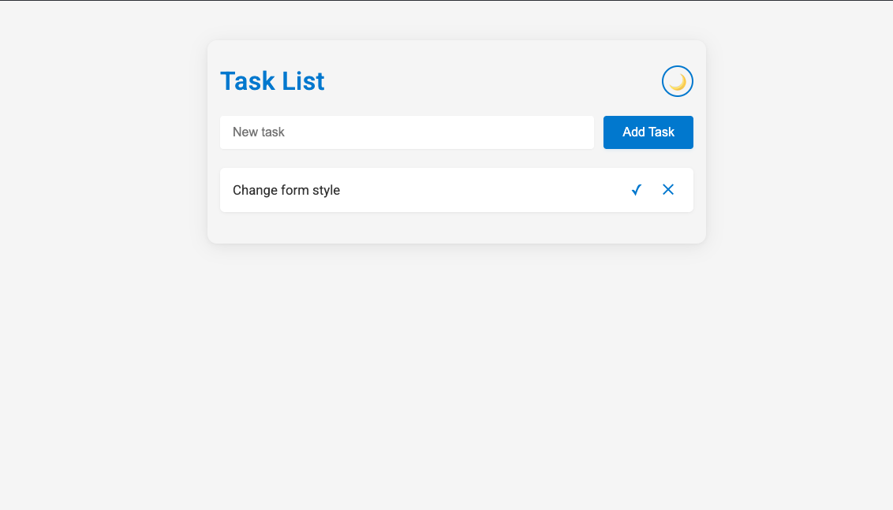
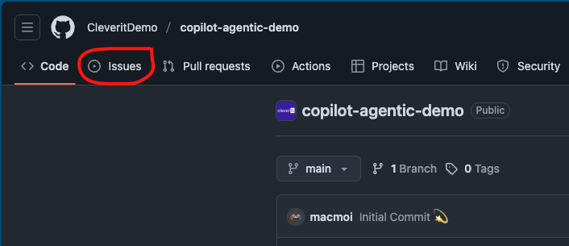
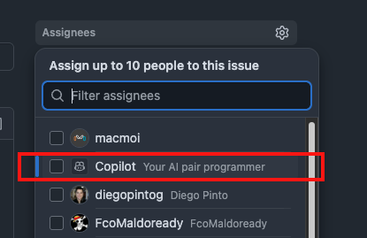
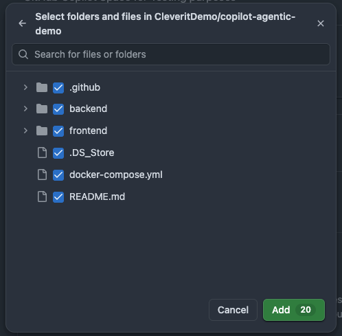
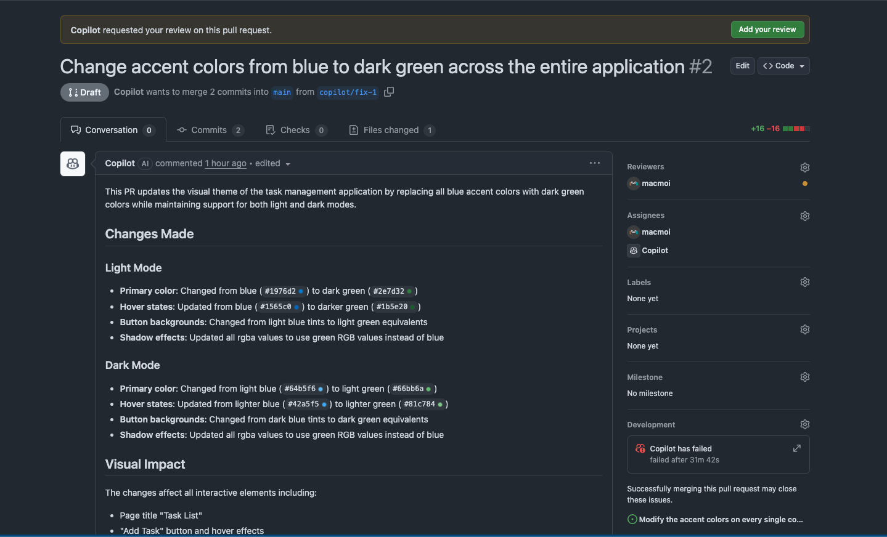
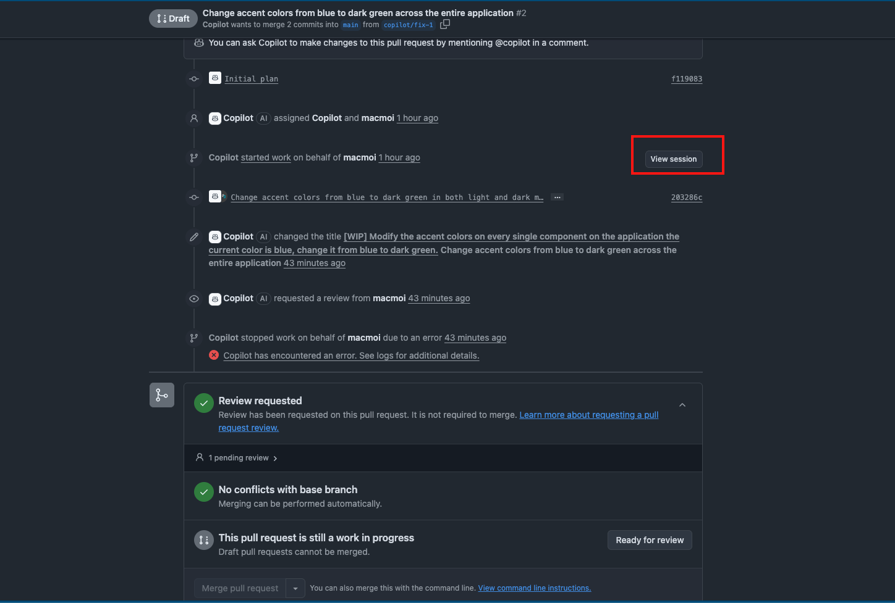

# Demo Agéntica de Copilot

Esta capacitación práctica te ayudará a familiarizarte con las potentes herramientas agénticas de GitHub, tales como: Copilot Coding Agent y GitHub Copilot Code Review; además, cubriremos espacios de documentación personalizados utilizando GitHub Copilot Spaces.

Para obtener más información sobre estas herramientas, puedes consultar los enlaces de documentación a continuación.

- [Coding Agent](https://docs.github.com/en/enterprise-cloud@latest/copilot/how-tos/use-copilot-agents/coding-agent)
- [Copilot Spaces](https://docs.github.com/en/copilot/how-tos/provide-context/use-copilot-spaces)
- [Code Review](https://docs.github.com/en/copilot/how-tos/use-copilot-agents/request-a-code-review)

## 🚀 Ejecutar la aplicación.

Para poner en marcha esta aplicación, consulta la página [about](./about.md). Contiene los pasos y requisitos necesarios para ejecutar esta aplicación localmente.

## 📔 Ejercicio de Capacitación

### 🧠 Paso 1. Uso de Copilot Coding Agent (Parte 1).

Para contextualizar los cambios que vamos a realizar, el objetivo aquí es cambiar los colores de acento de la aplicación Todo-List. Actualmente, la aplicación se ve así:



Cambiemos ese color de acento azul a uno diferente utilizando **Copilot Coding Agent**.

Para crear un nuevo issue, ve a la pestaña de issues en este repositorio.



Una vez en la pestaña de issues, vamos a crear uno nuevo haciendo clic en el botón **New Issue**.

Al llegar allí, completa el Título y la descripción. Para el título, utilizaremos este campo para indicar con precisión la acción que queremos lograr con el Coding Agent, en este caso queremos cambiar el color de acento de la aplicación.

Para este ejemplo, utiliza el siguiente texto como título del issue:

**Título del issue**
```
Modify the accent colors on every single component on the application the current color is blue, change it from blue to dark green.
```

Y si quieres añadir más contexto al agente, completa el campo de descripción para ayudar al agente de IA con más información.

**Descripción del issue**
```
Please keep in mind that all changes must be done for both look and feels of the app dark mode and light mode.
```

**Ejemplo**


Una vez completados ambos campos, asigna el issue a GitHub Copilot.



Luego guarda el issue. Esto abrirá un nuevo Pull Request en modo borrador (Draft), Copilot marcará este pull request como Trabajo en Progreso (WIP) y comenzará a realizar un análisis y una estrategia para completar la tarea.

**Issue Asignado a Copilot**


> 💡 **Consejo**.
> Observa el emoji de los ojos (👀), esto significa que Copilot está al tanto del issue y comenzará a trabajar.
> Además, nota cómo el PR se crea como borrador y se marca como Trabajo en Progreso (WIP).

Este proceso de Copilot realizando cambios puede tomar tiempo dependiendo de los cambios solicitados; mientras tanto, exploremos **GitHub Copilot Spaces**.

### 🪐 Paso 2. Uso de GitHub Copilot Spaces.

Copilot Spaces es una funcionalidad que proporciona un espacio "centralizado" donde el contexto puede ser personalizado y compartido con los miembros de una organización. Es una forma eficiente de compartir no solo conocimientos, sino también de centralizar la documentación.

En este ejercicio, veremos cómo podemos usar GitHub Copilot para generar documentación sobre esta aplicación y luego ponerla disponible a través de Copilot Spaces.

#### 2.1 Crear documentación.

Utiliza GitHub Copilot dentro de tu editor de código para crear archivos de documentación para este proyecto.

Primero, creemos una nueva rama en el repositorio llamada `copilot-spaces-branch`.

```
git checkout -b copilot-spaces-branch
```

Verifica que estás en esa rama usando el siguiente comando.

```
git branch
```

Ahora abre **VS Code**, abre el Chat de GitHub Copilot en modo Agente y utiliza el siguiente prompt para crear los documentos de la aplicación.

**Prompt de Copilot**
```
Improve #about.md file to include more advanced documentation of the project. Include sections indicating: Which are the runtimes and frameworks used in this project, explain in a detailed way how to execute the project and how it can be accessed through the browser.

Use a technical language kept in mind a target audience such as Developers, sysadmins, DevOps Engineers and Cloud Engineers.

Include emojis and icons whenever necessary.
```
El Chat de GitHub Copilot comenzará a realizar algunos cambios en el archivo [about](about.md). Verás algo como esto:


Si estás de acuerdo con la sugerencia, simplemente haz clic en el botón "keep".

Sube los cambios a Github ejecutando el siguiente comando.

**Añadir los archivos al área de preparación (staging)**
```
git add .
```

**Confirmar los cambios (commit)**
```
git commit -m "Updated documentation"
```

**Subir los cambios al repositorio Git (push)**
```
git push
```

#### 2.2 Creación de un entorno de Copilot Spaces.

Para esta parte, ve a [GitHub](https://github.com). Aquí debes abrir el menú de la barra lateral y hacer clic en la opción **Copilot**. Mira la siguiente imagen para más detalles.


Esto abrirá la interfaz web de GitHub Copilot; aquí haz clic en el botón "Spaces", lo cual abrirá GitHub Copilot Spaces.


En esta vista podemos crear un nuevo espacio haciendo clic en el botón **create space**, puedes completar los campos con los siguientes valores:


Esto creará un nuevo espacio de Copilot. Ahora comencemos a agregar contexto útil en este espacio. Agreguemos la documentación que creamos.

Aquí busca el repositorio en el que estamos trabajando y agrega las carpetas necesarias como fuente, luego haz clic en `add`.



Copilot comenzará a indexar los archivos y, una vez que haya terminado, podremos empezar a hacer algunas preguntas sobre el proyecto. Copilot responderá basándose en la información de todo el proyecto, incluida la documentación que creamos.

Pruébalo preguntándole a GitHub Copilot Spaces lo siguiente:

```
How can I execute this project and what are the runtimes of copilot-agentic-demo
```

### 🧠 Paso 3. Uso de GitHub Copilot Coding Agent (Parte 2).

Mientras configurábamos Copilot Spaces, el Coding Agent estuvo trabajando en segundo plano. Verifiquemos los resultados del issue que le asignamos. Para hacerlo, vayamos al issue creado anteriormente.

- Abre el issue.
- Abre el Pull Request asociado al issue y observa los resultados.
- Notarás que GitHub Copilot completó el PR con muchos detalles sobre los cambios realizados, también añadió la estrategia que utilizó e incluso algunas capturas de pantalla mostrando los cambios.



Si nos interesa ver cómo Copilot manejó esta situación y la estrategia y pasos que utilizó, podemos ver la sesión de actividad haciendo clic en el botón **view session** en la parte inferior del pull request, justo antes del botón Merge Pull Request.



Haz clic allí y verás una interfaz muy similar a la que encuentras en GitHub Actions, pero en este caso contendrá todos los pasos, comandos y decisiones que tomó el Coding Agent durante la ejecución del issue. Básicamente, estos son los pasos que siguió para completar la tarea.

Si estás de acuerdo con estos cambios, podemos marcar el PR como listo para revisión y completar la solicitud de fusión (merge).

Esto fusionará los cambios sugeridos por Copilot desde la rama de trabajo a la rama de destino (en este caso, la rama main).

### 👀 Paso 4. GitHub Copilot Code Review.

Imaginemos que las sugerencias creadas por el Coding Agent fueron creadas por un compañero de equipo u otra persona, y en el flujo del SDLC se necesita una revisión de código. Esto es algo que se puede automatizar con GitHub Copilot.

Para usar el Code Review agéntico, simplemente podemos ir a cualquier pull request abierto y asignar la revisión a GitHub Copilot.


Si hay algo que se pueda mejorar, Copilot dejará comentarios automáticamente en los archivos que pueden ser optimizados. Y también dejará una explicación del PR y sugerencias en el propio PR.

Si todo se ve bien, en este momento puedes realizar un Merge entre la rama de trabajo y la rama main.

----

**¡Has llegado al final de la capacitación. Felicidades!!💫**

Al final, si descargas los cambios sugeridos por Copilot y construis la aplicación en tu entorno local, deberías ver este resultado:


